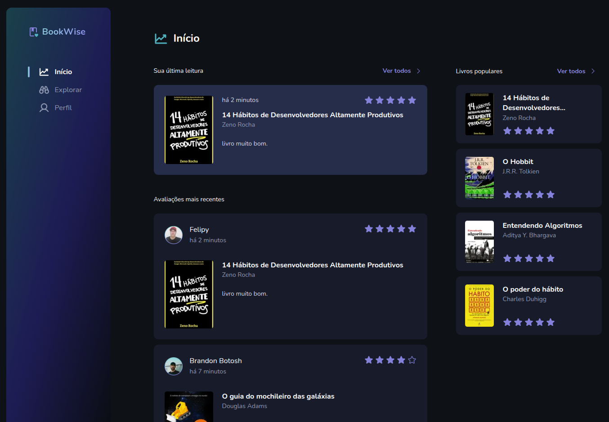

# BookWise - Plataforma de Recomendações de Livros




Uma plataforma onde leitores podem avaliar e ver avaliações de outros leitores sobre os mais diversos livros, com login disponível via GitHub, Google ou como visitante.

## 📚 Funcionalidades

- Cadastro e autenticação de usuários via GitHub, Google ou como visitante
- Visualização de uma lista de livros disponíveis para avaliação
- Pesquisa de livros por título ou autor
- Avaliação de livros com nota e comentário
- Visualização de avaliações feitas por outros usuários
- Perfil do usuário com histórico de avaliações realizadas
- Listagem dos livros mais populares e mais bem avaliados
- Página de detalhes de cada livro, incluindo avaliações e informações do autor
- Sistema de recomendação de livros baseado nas avaliações dos usuários
- Interface responsiva e moderna

## 🌐 Deploy

- **Acesse o projeto online**: https://nextjs-bookwise-rocketseat-2025.vercel.app/

## 🛠️ Tecnologias

- **Frontend**: Next.js, React, TypeScript
- **Styling**: Stitches
- **Banco de dados**: PostgreSQL
- **ORM**: Prisma
- **Autenticação**: NextAuth.js
- **Estado**: React Query (TanStack Query)
- **Formulários**: React Hook Form + Zod

## 🎨 Design

- **Figma**: https://www.figma.com/design/jGq0R1FGwVc7XdQAsvJ0iG/BookWise--%E2%80%A2-Desafio-React--Copy-?node-id=0-1&p=f&t=5y5JubnuABnPXVhh-0

## 📋 Desafio

- **Descrição**: https://efficient-sloth-d85.notion.site/Desafio-06-Criando-uma-aplica-o-Fullstack-d85bc26f34754d0590b6116a35c9de23

## 🚀 Como executar o projeto

### Pré-requisitos

- Node.js 18+
- Docker
- npm 

#### 1. Clone o repositório

```bash
git clone <url-do-repositorio>
cd 7-desafio-bookwise
```

#### 2. Inicie o container do PostgreSQL

```bash
# Inicia o container do PostgreSQL
docker-compose up -d

# Verifica se o container está rodando
docker-compose ps
```

#### 3. Configure as variáveis de ambiente

Duplique o arquivo `.env.example`, renomeie para `.env` na raiz do projeto e preencha as variáveis conforme necessário.

#### 4. Instale as dependências

```bash
npm install
```

#### 5. Configure o banco de dados

```bash
# Gera e aplica as migrations
npx prisma migrate deploy

# Popula o banco com dados iniciais
npx prisma db seed
```

#### 6. Execute o projeto

```bash
npm run dev
```

O projeto estará disponível em `http://localhost:3000`